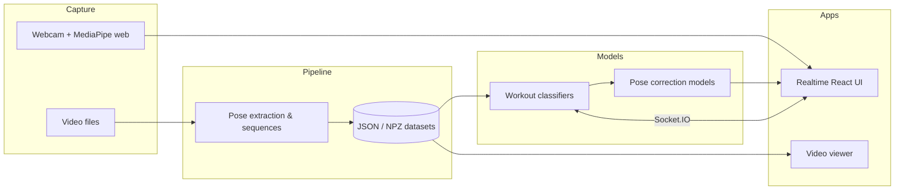

# TrueForm

**Turn camera pixels into structured movement: extract poses from video, recognize exercises with machine learning, and surface form cues in real time.**

[](https://www.python.org/)
[](https://developers.google.com/mediapipe)
[](https://react.dev/)
[](https://flask.palletsprojects.com/)
[-98.7%25%20Transformer-brightgreen)](#results-and-performance)
[-98.2%25-green)](#results-and-performance)

TrueForm is an end-to-end **fitness pose intelligence** stack: a Python data pipeline for video and landmarks, Jupyter-based research for **workout classification** and **pose correction**, and a **React + Flask** experience that runs **MediaPipe in the browser** and streams predictions over **Socket.IO**.

If you care about **how a rep looks**, not just whether it happened, this repository is the reference implementation.

---

## Results and performance

> **98.7%** peak **test** accuracy (Transformer, 17-class checkpoint) · **98.2%** XGBoost (16-class) · sequence models (**BiGRU**, **BiLSTM**) **98.4–98.5%** on the same family of pose windows.

Bundled **workout classifiers** are evaluated on a **held-out test split**; figures below come from the shipped [`AI/workout_classifier/models/`](AI/workout_classifier/models/) metadata files (`model_metadata*.json`).

| Model | Test accuracy | Classes | Artifact |
|------:|:--------------:|:-------:|----------|
| **Transformer** | **98.7%** | 17 | `transformer_workout_classifier.keras` |
| **BiGRU** | **98.5%** | 16 | `gru_workout_classifier.keras` |
| **BiLSTM** | **98.4%** | 16 | `bilstm_workout_classifier.keras` |
| **XGBoost** | **98.2%** | 16 | `xgboost_workout_classifier.pkl` |
| **Random Forest** | **98.0%** | 17 | `randomforest_workout_classifier.pkl` |

<details>
<summary><strong>Exact values from metadata</strong> (for reproducibility)</summary>

| Model | `test_accuracy` |
|-------|----------------:|
| Transformer | 0.986654 |
| BiGRU | 0.985054 |
| BiLSTM | 0.983514 |
| XGBoost | 0.982246 |
| Random Forest | 0.979854 |

</details>

**Takeaway:** sequence models on normalized pose windows reach **up to ~98.7%** test accuracy on this checkpoint’s label set; **XGBoost** remains a strong **~98.2%** classical baseline on **16** classes. Class counts differ slightly by checkpoint (16 vs 17) because of how each training run was sliced from the pipeline—see each `class_names*.json` next to the model.

### Pose correction (single-frame displacement)

The [`AI/pose_correction_single_frame/`](AI/pose_correction_single_frame/) notebooks define a **predict-zero baseline** on the metric that matters: **masked MAE on joints with non-zero ground-truth displacement** (printed baseline **0.099754** ≈ **0.10** on the committed run). Final values are the **best validation** `val_masked_displaced_joint_mae` seen in the saved training logs.

**Relative MAE reduction** (same formula for each row): **100 × (baseline − final) / baseline**.

| Model | Notebook | Baseline MAE | Final val MAE | **Improvement** |
|-------|----------|-------------:|--------------:|--------------:|
| MLP | [`MLP_pose_correction_single_frame.ipynb`](AI/pose_correction_single_frame/MLP_pose_correction_single_frame.ipynb) | 0.0998 | 0.0246 | **75%** |
| DNN | [`DNN_pose_correction_single_frame.ipynb`](AI/pose_correction_single_frame/DNN_pose_correction_single_frame.ipynb) | 0.0998 | 0.0243 | **76%** |
| GNN | [`GNN_pose_correction_single_frame.ipynb`](AI/pose_correction_single_frame/GNN_pose_correction_single_frame.ipynb) | 0.0998 | 0.0390 | **61%** |

Temporal pose-correction models under [`AI/pose_correction/`](AI/pose_correction/) (LSTM, TCN-FiLM, TFT, etc.) optimize **MSE / MAE on full displacement vectors** with a different scale than this masked single-frame baseline; see each notebook’s `val_loss` / `val_mae` curves rather than the **0.10** reference.

The single-frame notebooks also note a **frame-level train/val split** (not video-level), so treat these metrics as **in-repo benchmarks**, not guarantees of generalization to new videos until you add a video-held-out evaluation.

---

## Why TrueForm

| You want to… | TrueForm gives you… |
|----------------|---------------------|
| Build a dataset from workout footage | MediaPipe-based extraction, normalization, and sequence packaging from `Data/` |
| Train or compare classifiers | Notebooks and artifacts for tree-based and sequence models in `AI/workout_classifier/` |
| Study *how* to correct form | Pose-correction experiments (temporal and single-frame) under `AI/pose_correction*` |
| Ship a live demo | A Vite + React client with skeleton overlay and a selectable model stack in `Webapp/` |

---

## What you get out of the box

- **Pose from video** — 12 core body landmarks per frame (shoulders, elbows, wrists, hips, knees, ankles), **hip-centered normalization** for position invariance, and **fixed-length sequences** for ML (defaults are tunable: FPS, window length, parallelism).
- **Workout classification** — Trained pipelines including **XGBoost**, **Random Forest**, and sequence models (**Transformer**, **BiLSTM**, **BiGRU**) used by the realtime app. See **[Results and performance](#results-and-performance)** for test accuracies on the bundled checkpoints.
- **Pose correction research** — Temporal models (e.g. LSTM embedding, TCN-FiLM, TFT) and **single-frame** correction explorations (MLP, DNN, GNN notebooks) for displacement and coaching-style signals.
- **Realtime web app** — Webcam **MediaPipe** on the client, **Flask-SocketIO** inference on the server, **top predictions**, and **correction overlays** (arrows) driven by the selected model pair. Muscle illustrations are present in the UI as static reference art.

---

## Architecture at a glance



---

## Repository map

```
TrueForm/
├── Data/                    # Extraction, batch processing, local visualizers
│   ├── video_pose_extractor.py
│   ├── pose_visualizer.py
│   ├── video_viewer/        # Flask + React video browser with pose overlay
│   └── web_scrapper/        # Helpers for sourcing training media
├── AI/
│   ├── workout_classifier/  # Notebooks + exported models (XGBoost, RF, …)
│   ├── pose_correction/     # Temporal correction notebooks & utilities
│   ├── pose_correction_single_frame/
│   └── pose_visualizer_with_predictions.py
└── Webapp/                  # Realtime classifier + correction (Vite + Flask-SocketIO)
    ├── backend/
    └── frontend/
```

Deeper component docs live next to the code: [`Data/README.md`](Data/README.md), [`Data/video_viewer/README.md`](Data/video_viewer/README.md), [`Webapp/README.md`](Webapp/README.md).

---

## Quick start

### 1. Clone

```bash
git clone https://github.com/yasinetawfeek/TrueForm.git
cd TrueForm
```

### 2. Data pipeline (Python)

```bash
cd Data
pip install -r requirements.txt
python video_pose_extractor.py path/to/video.mp4 -o output/
```

Interactive inspection of saved sequences:

```bash
python pose_visualizer.py output/training_data.json
```

### 3. Realtime workout + corrections (recommended demo)

Backend (expects a Conda env named `true_form` — adjust to your setup):

```bash
cd Webapp
conda run -n true_form pip install -r backend/requirements.txt
npm --prefix frontend install
npm run dev:backend
```

Frontend (second terminal):

```bash
cd Webapp
npm run dev
```

Open **http://localhost:5173**. The UI talks to the API on **http://localhost:8001** by default; see [`Webapp/README.md`](Webapp/README.md) for ports and `VITE_AI_URL`.

### 4. Train or explore models

```bash
cd AI/workout_classifier
jupyter notebook XGboost_workout_classifier.ipynb
```

Pose-correction notebooks live under `AI/pose_correction/` and `AI/pose_correction_single_frame/`.

---

## Exercise coverage

- **Data organization** supports a broad set of strength movements (see [`Data/README.md`](Data/README.md) for the full taxonomy used in folders and extraction).
- **Bundled XGBoost labels** (16 classes) are listed in [`AI/workout_classifier/models/class_names.json`](AI/workout_classifier/models/class_names.json). Your own runs can expand or change this set as you add data.

---

## Tech stack

| Layer | Choices |
|-------|---------|
| Pose | [MediaPipe Pose](https://google.github.io/mediapipe/solutions/pose) (Python + browser) |
| Video / numerics | OpenCV, NumPy |
| Classical ML | scikit-learn, XGBoost |
| Deep learning | TensorFlow / Keras (notebooks + realtime correction paths) |
| APIs | Flask, Flask-SocketIO |
| Web UI | React 18, Vite |

---

## Contributing

Issues and pull requests are welcome. For code style, prefer **PEP 8** on Python, match existing patterns in each subproject, and update the relevant subdirectory README when behavior or setup changes.

---

## Acknowledgments

Built on [MediaPipe](https://developers.google.com/mediapipe), the [OpenCV](https://opencv.org/) ecosystem, and the open-source ML tools cited in each component’s `requirements.txt`. Thanks to everyone who files issues, tries the notebooks, and improves the demos.

---

<p align="center">
  <strong>TrueForm</strong> — structure in every rep.<br/>
  <sub>If this project helps your work, consider starring the repo on GitHub.</sub>
</p>
